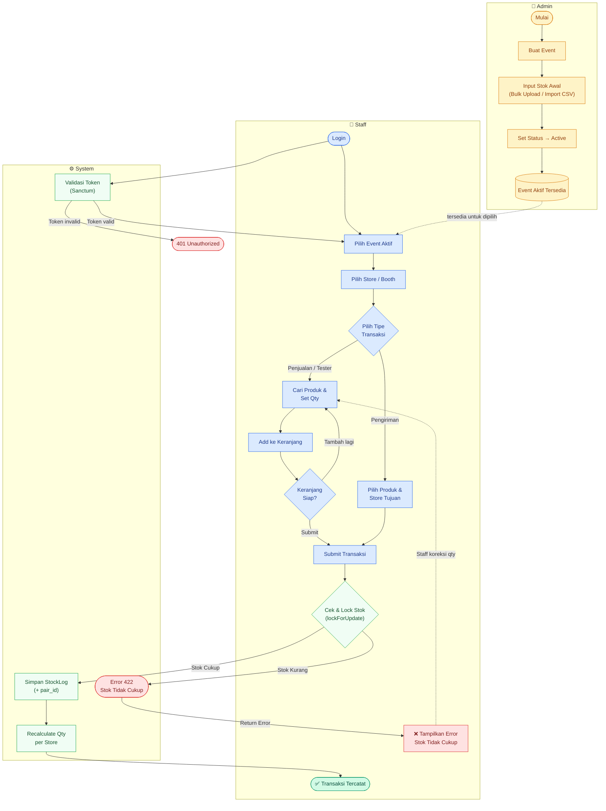

# Alur Sistem Event Stock — Saff & Co.

## Flowchart (Mermaid)



---

## Deskripsi Sistem

Sistem Event Stock SAFF & Co. adalah modul manajemen stok khusus untuk event (booth/pameran). Sistem ini memungkinkan admin menyiapkan event + stok awal, lalu staff mencatat transaksi real-time di lapangan melalui 3 tipe: **Penjualan**, **Tester**, dan **Pengiriman antar booth**.

---

## Aktor & Peran

| Aktor  | Tanggung Jawab |
|--------|----------------|
| **Admin** | Membuat event, input stok awal (bulk/import), mengaktifkan event |
| **Staff** | Login, memilih event, mencatat transaksi di booth/store |
| **System** | Validasi token, lock stok, mencatat log, recalculate saldo stok |

---

## Tipe Transaksi

### 1. Penjualan
Produk terjual ke pembeli (mengurangi stok booth).

- Input: produk, qty, harga (opsional)
- Effect: StockLog bertipe `penjualan`, qty dikurangi dari stok booth asal

### 2. Tester
Produk digunakan sebagai tester (mengurangi stok, bukan penjualan).

- Input: produk, qty
- Effect: StockLog bertipe `tester`, qty dikurangi

### 3. Pengiriman (Transfer antar Booth)
Stok dipindah dari satu store/booth ke store/booth lain dalam event yang sama.

- Input: produk, qty, store asal, store tujuan
- Effect: **dua** StockLog dibuat secara atomic:
  - `pengiriman_out` di store asal (qty negatif)
  - `pengiriman_in` di store tujuan (qty positif)
  - Keduanya dihubungkan oleh `pair_id` yang sama
- System wajib lock stok store asal (`lockForUpdate`) sebelum debit

---

## Alur Detail per Tahap

### Tahap 1 — Persiapan Event (Admin)

```
Admin → Buat Event
     → Input Stok Awal per Produk per Store (CSV/bulk)
     → Set Event Status: Active
```

Setelah aktif, event tersedia untuk dipilih oleh staff.

### Tahap 2 — Sesi Staff di Lapangan

```
Staff → Login (Sanctum token)
     → Pilih Event Aktif
     → Pilih Store / Booth yang dijaga
     → Pilih Tipe Transaksi
```

### Tahap 3 — Transaksi Penjualan / Tester

```
Staff → Cari produk (by nama / SKU)
     → Set qty
     → Add ke keranjang (bisa multi-produk)
     → (Ulangi jika perlu)
     → Submit Transaksi

System → Terima payload
       → Validasi token
       → Lock stok tiap produk (lockForUpdate)
       → Cek stok cukup?
         ✅ Ya → Simpan StockLog, recalculate qty
         ❌ Tidak → Return 422 "Stok tidak cukup"
```

### Tahap 4 — Transaksi Pengiriman

```
Staff → Pilih produk + qty yang dikirim
     → Pilih store tujuan
     → Submit

System → Validasi token
       → Lock stok store asal (lockForUpdate)
       → Cek stok cukup untuk dikirim?
         ✅ Ya → Buat StockLog OUT (store asal) + IN (store tujuan)
                 dengan pair_id yang sama (UUID)
                 → Recalculate qty kedua store
         ❌ Tidak → Return 422
```

### Tahap 5 — Error Handling

Jika stok tidak cukup:
- System return HTTP 422 dengan pesan `"Stok tidak cukup untuk [nama produk]"`
- Frontend menampilkan error di UI
- Staff mengoreksi qty atau membatalkan item

---

## Data Model

### `events`
| Kolom | Tipe | Keterangan |
|-------|------|------------|
| id | bigint PK | |
| title | string | Nama event (mis. "Pameran April 2026") |
| description | text nullable | |
| location | string | Tempat event |
| start_date | date | |
| end_date | date | |
| status | enum | `draft`, `active`, `closed` |
| created_by | FK users | Admin yang membuat |

### `stores` (Booth/Counter per Event)
| Kolom | Tipe | Keterangan |
|-------|------|------------|
| id | bigint PK | |
| event_id | FK events | |
| name | string | Nama booth (mis. "Booth A", "Counter 2") |
| location | string nullable | Lokasi spesifik di venue |
| type | enum | `booth`, `store`, `counter` |

### `products`
| Kolom | Tipe | Keterangan |
|-------|------|------------|
| id | bigint PK | |
| name | string | |
| sku | string unique | |
| description | text nullable | |
| unit | string | `pcs`, `ml`, `gr`, dll |

### `stock_logs`
| Kolom | Tipe | Keterangan |
|-------|------|------------|
| id | bigint PK | |
| event_id | FK events | |
| store_id | FK stores | |
| product_id | FK products | |
| transaction_id | FK transactions | |
| type | enum | `initial`, `penjualan`, `tester`, `pengiriman_out`, `pengiriman_in` |
| qty | integer | Positif = masuk, Negatif = keluar |
| pair_id | uuid nullable | Hanya untuk pasangan `pengiriman_out`↔`pengiriman_in` |
| notes | text nullable | |
| created_by | FK users | Staff yang submit |
| created_at | timestamp | |

### `transactions`
| Kolom | Tipe | Keterangan |
|-------|------|------------|
| id | bigint PK | |
| event_id | FK events | |
| store_id | FK stores | Store asal transaksi |
| type | enum | `penjualan`, `tester`, `pengiriman` |
| status | enum | `submitted`, `cancelled` |
| total_items | integer | |
| created_by | FK users | |
| submitted_at | timestamp | |

### `transaction_items`
| Kolom | Tipe | Keterangan |
|-------|------|------------|
| id | bigint PK | |
| transaction_id | FK transactions | |
| product_id | FK products | |
| qty | integer | |
| destination_store_id | FK stores nullable | Hanya untuk pengiriman |

---

## Kalkulasi Stok Real-Time

Stok aktual per produk per store dihitung dari **sum StockLog**:

```sql
SELECT
  event_id,
  store_id,
  product_id,
  SUM(qty) AS current_qty
FROM stock_logs
WHERE event_id = ?
GROUP BY event_id, store_id, product_id;
```

Atau disimpan sebagai **cached column** `current_stocks` yang di-update setiap transaksi berhasil (recalculate Qty).

---

## API Endpoints

### Admin

| Method | Endpoint | Deskripsi |
|--------|----------|-----------|
| `POST` | `/api/events` | Buat event baru |
| `GET` | `/api/events` | List semua event |
| `PATCH` | `/api/events/{id}/status` | Set status (`active`/`closed`) |
| `POST` | `/api/events/{id}/stocks/bulk` | Import stok awal (CSV/JSON) |
| `GET` | `/api/events/{id}/stocks` | Lihat saldo stok per store |
| `GET` | `/api/events/{id}/reports` | Laporan transaksi event |

### Staff

| Method | Endpoint | Deskripsi |
|--------|----------|-----------|
| `GET` | `/api/events/active` | Ambil event yang sedang active |
| `GET` | `/api/events/{id}/stores` | List store/booth dalam event |
| `GET` | `/api/stores/{id}/stocks` | Cek stok produk di store |
| `GET` | `/api/products?search=` | Cari produk by nama/SKU |
| `POST` | `/api/transactions` | Submit transaksi (penjualan/tester/pengiriman) |
| `GET` | `/api/transactions?store_id=` | Riwayat transaksi staff |

### Payload Submit Transaksi

**Penjualan / Tester:**
```json
{
  "event_id": 1,
  "store_id": 2,
  "type": "penjualan",
  "items": [
    { "product_id": 5, "qty": 3 },
    { "product_id": 8, "qty": 1 }
  ]
}
```

**Pengiriman:**
```json
{
  "event_id": 1,
  "store_id": 2,
  "type": "pengiriman",
  "items": [
    {
      "product_id": 5,
      "qty": 10,
      "destination_store_id": 4
    }
  ]
}
```

---

## Aturan Bisnis

1. **Event harus berstatus `active`** agar bisa dipilih staff.
2. **Stok awal wajib diinput admin** sebelum staff bisa bertransaksi.
3. **Satu staff = satu store aktif per sesi** — staff memilih store di awal sesi.
4. **Penjualan & Tester** tidak memerlukan cek stok minimum (stok bisa 0 = sold out ditampilkan), atau bisa dikonfigurasi agar tidak boleh negatif.
5. **Pengiriman** selalu dicek stok:
   - Stok store asal harus ≥ qty yang dikirim
   - Jika tidak cukup → `422 Unprocessable Entity`
6. **pair_id** adalah UUID yang dibuat sekali per operasi pengiriman, menghubungkan `pengiriman_out` dan `pengiriman_in` untuk keperluan audit/rollback.
7. **lockForUpdate** wajib digunakan di dalam DB transaction untuk mencegah race condition jika dua staff submit pengiriman dari store yang sama secara bersamaan.
8. **Tidak bisa edit transaksi yang sudah submitted** — hanya bisa dicatat sebagai retur/koreksi manual oleh admin.

---

## Contoh Skenario

### Skenario A: Penjualan di Booth

1. Staff Dewi login, pilih event "Pameran Juni 2026", pilih "Booth A"
2. Pilih tipe "Penjualan"
3. Cari produk "Parfum Rose 50ml", set qty 2
4. Tambah ke keranjang → cari "Body Lotion Vanilla", set qty 1 → add
5. Submit → System lock stok → stok cukup → 2 StockLog dibuat → Transaksi tercatat
6. UI menampilkan "✅ Transaksi Tercatat"

### Skenario B: Pengiriman antar Booth

1. Staff Ryan login, pilih event, pilih "Gudang Utama"
2. Pilih tipe "Pengiriman"
3. Pilih produk "Tester Kit A", qty 5, tujuan "Booth B"
4. Submit → System lock stok Gudang → stok 20 ≥ 5 ✅
5. Buat pair_id = `"abc-123"`, buat 2 StockLog:
   - `pengiriman_out` qty -5 di Gudang Utama, pair_id = "abc-123"
   - `pengiriman_in` qty +5 di Booth B, pair_id = "abc-123"
6. Recalculate: Gudang = 15, Booth B += 5

### Skenario C: Stok Tidak Cukup

1. Staff minta kirim qty 30 dari Booth A yang punya stok 20
2. System lock → cek stok 20 < 30 ❌
3. Return 422: `{ "message": "Stok tidak cukup. Tersedia: 20, Diminta: 30" }`
4. UI menampilkan error, staff ubah qty ke ≤ 20

---

## Pertimbangan Teknis

| Aspek | Keputusan | Alasan |
|-------|-----------|--------|
| Lock stok | `lockForUpdate` di DB transaction | Mencegah race condition multi-staff |
| Saldo stok | SUM dari StockLog | Audit trail lengkap, tidak kehilangan history |
| pair_id | UUID | Menghubungkan dua sisi transfer, memudahkan audit |
| Auth | Laravel Sanctum | Konsisten dengan LMS |
| Tipe transaksi | Enum ketat | Mencegah tipe tidak valid masuk DB |
| Error stok kurang | HTTP 422 | Semantically correct — bisa diproses (bukan 500) |

---

## Diagram ERD (Ringkas)

```
events ──< stores ──< stock_logs >── products
  │                       │
  └──< transactions ──< transaction_items >── products
            │
          stores (destination, nullable)
```

---

*Dokumen ini dibuat berdasarkan flowchart "Alur Sistem Event Stock — Saff & Co."*  
*Last updated: Juni 2026*
